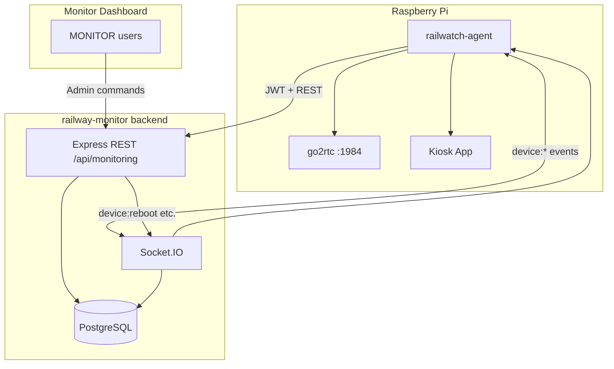
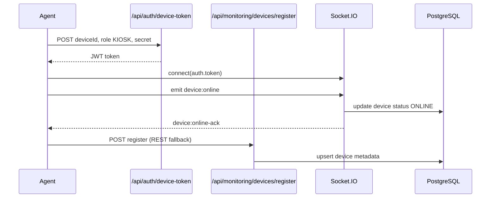
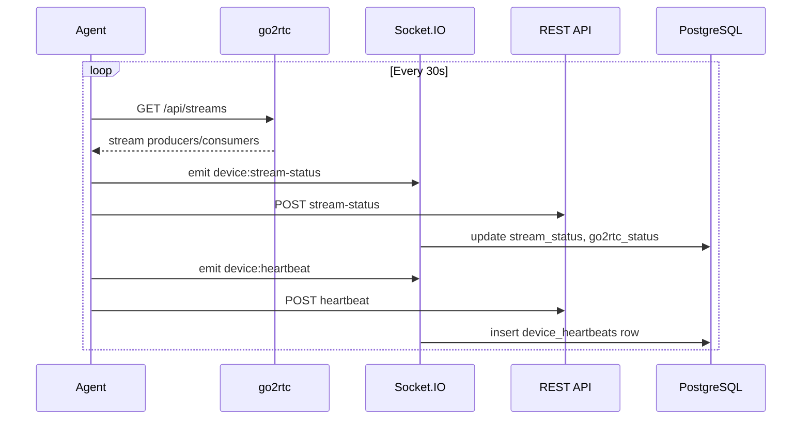
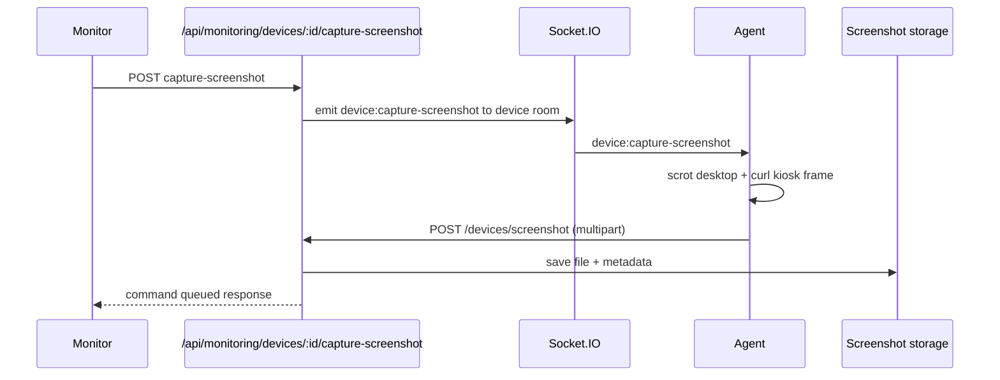

# Monitoring Agent — Architecture

## System Overview

## Components

| Component | Location | Role |
|-----------|----------|------|
| Device model | `railway-monitor/src/modules/divisions/device.model.js` | Reuses existing `devices` table |
| Monitoring module | `railway-monitor/src/modules/monitoring/` | REST APIs + business logic |
| Socket handlers | `railway-monitor/src/socket/monitoring.handlers.js` | Bidirectional `device:*` events |
| Agent | `pi-code/agent/` | Edge monitoring on Raspberry Pi |

## Data Flow — Registration

## Data Flow — Heartbeat & Streams

## Data Flow — Remote Screenshot

## Security

- Device REST endpoints require KIOSK JWT from `device-token`
- Admin endpoints require MONITOR+ app JWT via `requireAuth` + `requireMonitor`
- Rate limiting on all device events and REST endpoints
- Reconnect storm suppression (5s debounce on `device:online`)
- Audit logs on all admin commands

## Reused vs New

**Reused:** Device model, `authenticateSocket`, `registerAgent` logic, `DeviceCommand` queue, `DeviceLog`, audit service, RBAC middleware.

**New:** `device_heartbeats`, `device_screenshots` tables, `stream_status`/`go2rtc_status`/`agent_version` columns, monitoring module, `device:*` socket protocol, Pi agent.
