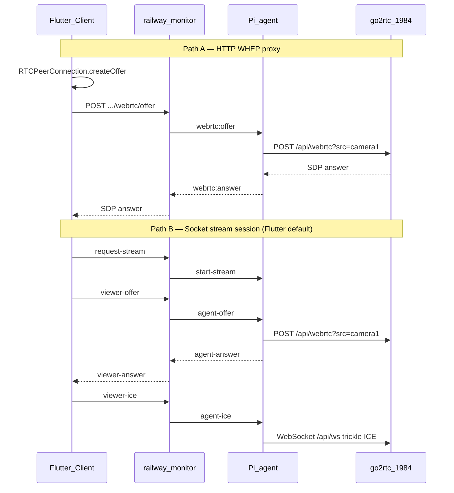
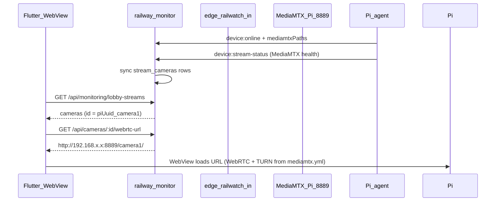

# go2rtc → MediaMTX Migration Audit

**Document version:** 1.0  
**Date:** 2026-06-20  
**Scope:** `pi-code`, `railway-monitor`, `remote_monitoring_system`  
**Status:** Implementation complete (direct Pi IP playback default; edge optional)

---

## 1. Executive summary

This migration replaces **go2rtc** (port 1984, custom WHEP + Socket.IO SDP relay) with **MediaMTX** on each Raspberry Pi. Playback uses **direct Pi LAN URLs** (`http://{pi_ip}:8889/{path}/`), matching the old go2rtc `pi_ip` model. Flutter loads the backend-issued URL in a WebView.

| Area | Before | After |
|------|--------|-------|
| Pi media gateway | go2rtc `:1984` | MediaMTX `:9997` API, `:8554` RTSP, `:8888` HLS, `:8889` WebRTC |
| Signaling | Backend + Pi relay SDP/ICE | None (browser ↔ MediaMTX on Pi LAN IP) |
| Camera discovery | `lobby-streams` + go2rtc stream names | Same endpoint; paths are MediaMTX path names |
| Playback URL | Client-built WHEP using `pi_ip` | `GET /api/cameras/:id/webrtc-url` → `http://{pi_ip}:8889/{path}` |
| Pi agent role | Poll go2rtc, proxy WebRTC | Register paths, poll MediaMTX health, JPEG frames via local RTSP |
| DB camera mapping | Implicit (`devices.go2rtc_status`) | Explicit `stream_cameras` table |

**Download location:** `pi-code/docs/go2rtc-to-mediamtx-migration-audit.md`

Related docs:

- Architecture reference: [`streaming-architecture-mediamtx.md`](streaming-architecture-mediamtx.md)
- Pi config template: [`mediamtx.example.yml`](mediamtx.example.yml)
- Pi systemd unit: [`mediamtx.service`](mediamtx.service)

---

## 2. Architecture change

### 2.1 Before (go2rtc)



### 2.2 After (MediaMTX)



**Note:** Edge proxy (`edge.railwatch.in`) is optional; default is direct Pi IP (go2rtc-style).

### 2.3 Component responsibilities (after)

| Component | Responsibility |
|-----------|----------------|
| **MediaMTX (Pi)** | RTSP ingest, HLS/WebRTC egress, path health API |
| **Pi agent** | Register paths, heartbeat, stream health polling, optional JPEG upload, remote commands |
| **railway-monitor** | Camera registry, RBAC, edge URL issuance, lobby discovery |
| **Edge proxy** (`edge.railwatch.in`) | Optional — only if monitors cannot reach Pi IPs; default is direct LAN URL |
| **Flutter** | Discover cameras, fetch play URL, render WebView |

---

## 3. End-to-end playback flow (new)

1. **Pi boot**
   - `mediamtx.service` starts with `/etc/mediamtx/mediamtx.yml`
   - PM2 starts `railwatch-agent`
   - Agent emits `device:online` with `capabilities.mediamtx: true` and `mediamtxPaths: ["camera1",…]`
   - Backend upserts `stream_cameras` for each path

2. **Health reporting** (every ~30s)
   - Agent: `GET http://127.0.0.1:9997/v3/paths/list` (fallback `/v2/paths/list`)
   - Agent: `POST /api/monitoring/devices/stream-status` with `mediamtx` block
   - Backend stores snapshot in `devices.stream_status` and `devices.go2rtc_status` (compat column name)

3. **Monitor opens CCTV grid**
   - Flutter: `GET /api/monitoring/lobby-streams`
   - Builds `CctvCameraEntity` with `id = {piDeviceId}_{streamName}`, e.g. `b6ee0d2b-…_camera1`
   - Tile detects `isMediaMtxStream` when both `piDeviceId` and `streamName` are set

4. **Stream playback**
   - Flutter: `GET /api/cameras/{id}/webrtc-url` with monitor JWT
   - Backend resolves camera (UUID or legacy `{piUuid}_{path}`), checks RBAC, returns:
     ```json
     {
       "url": "http://192.168.1.10:8889/camera1",
       "token": null,
       "camera": { "piIp": "192.168.1.10", "mediamtxPath": "camera1" }
     }
     ```
   - `MediaMtxStreamView` loads URL in `WebViewWidget` (appends `token` query param when present)

5. **Fallback**
   - Non-Pi cameras (no `piDeviceId`/`streamName`) still use HLS via `video_player`

---

## 4. Repository audit

### 4.1 pi-code

#### Added

| File | Purpose |
|------|---------|
| `docs/mediamtx.example.yml` | MediaMTX config: cameras 1–5 RTSP, WebRTC/HLS/API ports, TURN |
| `docs/mediamtx.service` | systemd unit for MediaMTX |
| `docs/streaming-architecture-mediamtx.md` | Target architecture reference |
| `docs/go2rtc-to-mediamtx-migration-audit.md` | This audit document |
| `agent/scripts/install-mediamtx.sh` | Download binary, deploy config, enable service, disable go2rtc |
| `agent/scripts/mediamtx-diagnose.js` | Local path list + WebRTC URL helper |
| `agent/test/mediamtx-diagnose.test.js` | Path normalization unit test |

#### Removed

| File | Former role |
|------|-------------|
| `docs/go2rtc.example.yaml` | go2rtc stream definitions |
| `agent/src/webrtc.js` | go2rtc WHEP + ICE WebSocket client |
| `agent/src/streamSession.js` | Socket stream-session SDP relay |
| `agent/src/sdpDiagnostics.js` | SDP debug helpers for go2rtc answers |
| `agent/scripts/generate-go2rtc-yaml.js` | go2rtc config generator |
| `agent/scripts/webrtc-diagnose.js` | go2rtc connectivity test |

#### Modified (key files)

| File | Change summary |
|------|----------------|
| `agent/src/config.js` | `MEDIAMTX_API_URL`, `MEDIAMTX_WEBRTC_BASE_URL`, `MEDIAMTX_PATHS`; removed go2rtc URL |
| `agent/src/socket.js` | Registration sends `mediamtxPaths`, `capabilities.mediamtx`; removed webrtc/streamSession attach |
| `agent/src/streams.js` | Polls MediaMTX `/v3/paths/list`; reports `mediamtx` in stream-status |
| `agent/src/heartbeat.js` | REST register includes `mediamtxPaths` |
| `agent/src/commands.js` | `restart-mediamtx`; legacy `restart-go2rtc` alias → `systemctl restart mediamtx` |
| `agent/src/streamFrames.js` | JPEG snapshots via `ffmpeg` + local RTSP `rtsp://127.0.0.1:8554/{path}` |
| `agent/src/screenshot.js` | Kiosk via `KIOSK_VNC_TARGET` + `vncsnapshot` |
| `agent/.env.example` | MediaMTX vars; removed go2rtc vars |
| `agent/README.md` | Updated ops docs |

#### Agent modules retained

| Module | Role post-migration |
|--------|---------------------|
| `auth.js` | Device JWT for REST/Socket |
| `cameraStreamer.js` | Optional persistent JPEG pipeline (`JPEG_PIPELINE_ENABLED`) |
| `screenshot.js` | Kiosk capture command |
| `updater.js` | Git pull remote update |

#### Pi agent — removed Socket/HTTP behaviors

- `webrtc:offer` / `webrtc:answer` handling
- `start-stream`, `agent-offer`, `agent-answer`, `agent-ice` stream session handlers
- All calls to go2rtc `:1984` (`/api/streams`, `/api/webrtc`, `/api/ws`, `/api/frame.jpeg`)

---

### 4.2 railway-monitor

#### Added

| File | Purpose |
|------|---------|
| `src/migrations/20260620140000-stream-cameras.cjs` | `stream_cameras` table |
| `src/modules/cameras/streamCamera.model.js` | Sequelize model |
| `src/modules/cameras/camera.service.js` | Sync, list, `buildWebrtcPlayUrl` |
| `src/modules/cameras/camera.controller.js` | HTTP handlers |
| `src/modules/cameras/camera.routes.js` | `GET /`, `GET /:id/webrtc-url` |
| `src/modules/monitoring/mediamtx.parser.js` | Normalizes MediaMTX path list API |
| `src/modules/monitoring/monitoring.ice.controller.js` | ICE config only (monitor/kiosk WebRTC) |
| `tests/cameras/camera.e2e.test.js` | webrtc-url endpoint e2e |
| `tests/monitoring/mediamtx.parser.unit.test.js` | Parser unit tests |

#### Removed

| File | Former role |
|------|-------------|
| `src/modules/monitoring/go2rtc.parser.js` | go2rtc `/api/streams` parser |
| `src/modules/monitoring/monitoring.webrtc.controller.js` | WHEP offer proxy |
| `src/modules/monitoring/webrtc-offer.relay.js` | Dead relay code |
| `tests/monitoring/monitoring.webrtc.unit.test.js` | Tests for removed WHEP routes |
| `tests/monitoring/monitoring.webrtc.e2e.test.js` | WHEP e2e (if existed) |

#### Modified (key files)

| File | Change summary |
|------|----------------|
| `src/modules/monitoring/monitoring.service.js` | MediaMTX enrichment; `syncCamerasForPiDevice`; lobby streams from MediaMTX health |
| `src/modules/monitoring/monitoring.routes.js` | Removed WHEP routes; added `restart-mediamtx`; kept legacy `restart-go2rtc` alias |
| `src/modules/monitoring/monitoring.validator.js` | Accepts `mediamtxPaths`, `mediamtx` in stream-status |
| `src/modules/monitoring/monitoring.controller.js` | `restartMediamtx` handler |
| `src/socket/stream.handlers.js` | **Stub no-op** (legacy signaling removed) |
| `src/socket/monitoring.handlers.js` | Removed `webrtc:answer` handler |
| `src/server.js` | Mount `/api/cameras`; `/mediamtx-test` page; removed `/webrtc-test` |
| `src/models/index.js` | `StreamCamera` associations |
| `.env.example` | `EDGE_WEBRTC_*` vars |
| `tests/monitoring/monitoring.e2e.test.js` | `go2rtc` → `mediamtx` in stream-status payload |
| `tests/streams/stream.e2e.test.js` | Skipped (`skip: true`) — legacy signaling tests |

#### API — removed endpoints

| Method | Path | Notes |
|--------|------|-------|
| POST | `/api/monitoring/devices/:id/streams/:streamName/webrtc/offer` | WHEP proxy removed |
| GET | `/webrtc-test` | Replaced by `/mediamtx-test` |
| * | `/api/streams/*` (stream-session REST) | Routes unmounted from server |

#### API — added endpoints

| Method | Path | Auth | Response |
|--------|------|------|----------|
| GET | `/api/cameras` | Monitor JWT | List registered cameras |
| GET | `/api/cameras/:id/webrtc-url` | Monitor JWT | `{ url, token?, expiresAt?, camera }` |
| POST | `/api/monitoring/devices/:id/restart-mediamtx` | Monitor JWT | Remote restart command |
| GET | `/mediamtx-test` | Public | Dev iframe test page |

#### API — unchanged (still used)

| Method | Path | Purpose |
|--------|------|---------|
| GET | `/api/monitoring/lobby-streams` | Camera discovery for Flutter |
| GET | `/api/monitoring/ice-config` | TURN for kiosk/monitor WebRTC (not CCTV) |
| GET | `/api/monitoring/devices/:id/streams/:name/frame` | JPEG fallback |
| POST | `/api/monitoring/devices/register` | Pi registration (+ `mediamtxPaths`) |
| POST | `/api/monitoring/devices/stream-status` | Pi health (+ `mediamtx`) |

#### Database

**New table: `stream_cameras`**

| Column | Type | Notes |
|--------|------|-------|
| `id` | UUID PK | Canonical camera id for API |
| `pi_device_id` | UUID FK → devices | Raspberry Pi agent |
| `division_id`, `lobby_id` | UUID FK | RBAC scoping |
| `mediamtx_path` | string(64) | e.g. `camera1` |
| `name` | string(150) | Display label |
| `location` | string | Optional |
| `is_active` | boolean | Soft enable |
| `meta` | JSONB | Source URL, sync timestamps |

Unique index: `(pi_device_id, mediamtx_path)`

**Legacy column retained:** `devices.go2rtc_status` (JSONB) — now stores MediaMTX health snapshots for dashboard compatibility. No rename migration applied.

**Migration to run:**

```bash
cd railway-monitor
npx sequelize-cli db:migrate
# Applies: 20260620140000-stream-cameras.cjs
```

---

### 4.3 remote_monitoring_system

#### Added

| File | Purpose |
|------|---------|
| `lib/presentation/pages/cctv/widgets/mediamtx_stream_view.dart` | Fetches webrtc-url, loads WebView |

#### Removed (go2rtc-era widgets — not present in workspace)

These were in the pre-migration git status as untracked/new; they are **not** part of the final tree:

- `socket_webrtc_stream_view.dart`
- `webrtc_stream_view.dart`
- `pi_stream_frame_view.dart`
- `stream_socket_client.dart`

No `go2rtc` string references remain under `lib/`.

#### Modified

| File | Change summary |
|------|----------------|
| `lib/domain/entities/cctv_camera_entity.dart` | Removed `go2rtcPort`, `localWebRtcOfferUrl`, `remoteWebRtcOfferUrl`; added `isMediaMtxStream` |
| `lib/data/dataSources/cctv_data_source_impl.dart` | Primary source: `lobby-streams`; camera id `{agentId}_{name}` |
| `lib/presentation/pages/cctv/widgets/cctv_camera_tile_widget.dart` | MediaMTX WebView for Pi cameras; HLS for others |
| `lib/presentation/pages/cctv/widgets/cctv_fullscreen_overlay.dart` | Fullscreen MediaMTX support |
| `lib/res/app_constants.dart` | `monitoringLobbyStreamsEndpoint`, `cameraWebrtcUrl()`; removed socket WebRTC CCTV flags |

#### Flutter playback priority (after)

1. **Pi camera** (`isMediaMtxStream`): `MediaMtxStreamView` → backend webrtc-url → WebView
2. **Other cameras**: HLS via `video_player`

Removed paths:

- Socket WebRTC (`request-stream`, `viewer-offer`, `viewer-answer`)
- HTTP WHEP (direct or proxied go2rtc)
- go2rtc local reachability probe (`:1984/api/streams`)
- JPEG polling as primary CCTV path (frame endpoints still exist on backend for other uses)

**Note:** `webrtc_*` files under `lib/core/` and `lib/data/repos/` relate to **kiosk/monitor call WebRTC**, not CCTV — intentionally retained.

---

## 5. Environment variable audit

### 5.1 pi-code — agent

| Variable | Before | After | Required |
|----------|--------|-------|----------|
| `GO2RTC_URL` | `http://127.0.0.1:1984` | **Removed** — delete from deployed `.env` | — |
| `MEDIAMTX_API_URL` | — | `http://127.0.0.1:9997` | Recommended |
| `MEDIAMTX_WEBRTC_BASE_URL` | — | `http://127.0.0.1:8889` | For diagnostics |
| `MEDIAMTX_PATHS` | — | `camera1,camera2,camera3,camera4,camera5` | Yes |
| `JPEG_PIPELINE_ENABLED` | — | `false` (WebRTC-only Pi) | Optional |
| `KIOSK_VNC_TARGET` | — | `host:display` for kiosk frames | If kiosk paths used |

**Action required on deployed Pis:** Update root `.env` and `agent/.env` — replace `GO2RTC_URL` with MediaMTX vars above.

### 5.2 railway-monitor — backend

| Variable | Before | After | Default |
|----------|--------|-------|---------|
| `GO2RTC_PORT` | `1984` | **Unused** — safe to remove | — |
| `GO2RTC_SOCKET_TIMEOUT_MS` | set | **Unused** | — |
| `GO2RTC_FETCH_TIMEOUT_MS` | set | **Unused** | — |
| `GO2RTC_HOST` | optional | **Unused** | — |
| `PI_WEBRTC_PLAYBACK_MODE` | — | **New** (default `direct`) | Per-Pi IP URLs |
| `MEDIAMTX_WEBRTC_SCHEME` | — | **New** | `http` |
| `MEDIAMTX_WEBRTC_PORT` | — | **New** | `8889` |
| `EDGE_WEBRTC_BASE_URL` | — | Optional | Only when `PI_WEBRTC_PLAYBACK_MODE=edge` |
| `EDGE_WEBRTC_JWT_SECRET` | — | Optional | Edge mode token signing |
| `EDGE_WEBRTC_TOKEN_TTL_SEC` | — | Optional | `3600` |
| `TURN_USERNAME` / `TURN_PASSWORD` | used | **Still used** | ICE for kiosk calls + MediaMTX config |

### 5.3 remote_monitoring_system

No new env files. Backend URL is configured in `lib/res/app_constants.dart`:

- `backendBaseUrl` → used for `lobby-streams` and `webrtc-url`
- No client-side go2rtc port or WHEP URL construction

### 5.4 MediaMTX config (on Pi)

Set in `/etc/mediamtx/mediamtx.yml` (from `docs/mediamtx.example.yml`):

| Setting | Value | Notes |
|---------|-------|-------|
| `apiAddress` | `:9997` | Agent health polling |
| `rtspAddress` | `:8554` | Local RTSP for ffmpeg snapshots |
| `hlsAddress` | `:8888` | Optional browser HLS |
| `webrtcAddress` | `:8889` | Browser WebRTC pages |
| `webrtcAdditionalHosts` | Pi LAN IP, DNS | Must match what browsers/edge use |
| `webrtcICEServers2` | TURN server | Match backend TURN credentials |
| `paths.camera1–5.source` | Dahua RTSP URLs | Per-site credentials |
| `paths.kiosk1/2` | stubs | VNC not migrated yet |

---

## 6. Port and network map

| Port | Service | Exposure |
|------|---------|----------|
| 1984 | go2rtc | **Retire** — stop/disable after MediaMTX verified |
| 8554 | MediaMTX RTSP | Pi localhost (+ optional LAN debug) |
| 8888 | MediaMTX HLS | Pi / edge |
| 8889 | MediaMTX WebRTC | Pi / edge (primary playback) |
| 9997 | MediaMTX API | Pi localhost only |
| 3478 | TURN | Public (existing) |

**Default playback (direct):** `http://{devices.ip_address}:8889/{path}/` — same network model as go2rtc `:1984`.

**Optional edge:** `https://edge.railwatch.in/webrtc/{path}` → Pi `:8889` when `PI_WEBRTC_PLAYBACK_MODE=edge`.

---

## 7. Cleanup status

### 7.1 Fully removed

- go2rtc config and install scripts from pi-code repo
- Pi agent WebRTC/SDP relay code
- Backend WHEP offer proxy and go2rtc parser
- Backend `webrtc:answer` socket handler
- Flutter custom CCTV WebRTC views and go2rtc URL fields
- Stale backend WebRTC unit test file

### 7.2 Intentionally retained (compat / other features)

| Item | Reason |
|------|--------|
| `restart-go2rtc` API + socket alias | Ops scripts may still call it; maps to mediamtx restart |
| `RESTART_GO2RTC` command enum in DB | Avoid migration; command executes mediamtx restart |
| `devices.go2rtc_status` column | Dashboard reads; stores MediaMTX data |
| `updateGo2rtcStatus()` function name | Internal alias writing mediamtx snapshots |
| `stream.service.js`, `stream.validator.js` | Module files remain; routes unmounted, handlers stubbed |
| `tests/streams/stream.e2e.test.js` | Skipped, documents removed signaling |
| `GET /api/monitoring/ice-config` | Kiosk/monitor call WebRTC (separate from CCTV) |
| Flutter `webrtc_*` services | Kiosk monitoring calls, not CCTV |
| `validateStreamStatusPayload` accepts `go2rtc` key | Backward compat for old agents during rollout |

### 7.3 Outstanding operator cleanup

| Item | Action |
|------|--------|
| Pi root `.env` still has `GO2RTC_URL` | Replace with `MEDIAMTX_*` vars |
| go2rtc systemd on Pis | `install-mediamtx.sh` disables it; verify on each Pi |
| Edge proxy | Deploy/configure reverse proxy to Pi `:8889` |
| DB migration | Run `20260620140000-stream-cameras.cjs` on production DB |
| Rename `go2rtc_status` → `mediamtx_status` | Optional future migration (not done) |
| Delete `src/modules/streams/*` entirely | Optional; currently inert |

---

## 8. Remote commands audit

| Command (API / socket) | Pi action | Notes |
|------------------------|-----------|-------|
| `restart-mediamtx` | `sudo systemctl restart mediamtx` | Preferred |
| `restart-go2rtc` | Same as above | Legacy alias |
| `restart-agent` | PM2 restart | Unchanged |
| `reboot` | System reboot | Unchanged |
| `capture-screenshot` | vncsnapshot / scrot | Unchanged |
| `update` | Git pull | Unchanged |

---

## 9. Testing audit

| Suite | Status | Notes |
|-------|--------|-------|
| pi-code `npm test` (agent) | **8/8 pass** | Includes mediamtx path normalization |
| railway-monitor unit (mediamtx, monitoring) | **9/9 pass** | No server required |
| railway-monitor full `npm test` | Requires running API on `:3000` | Includes e2e |
| Flutter analyze (CCTV files) | **No issues** | mediamtx_stream_view, tile, entity |
| End-to-end camera1 | **Not verified in CI** | Requires Pi + edge + monitor login |

**Recommended manual test plan:**

1. On Pi: `curl -s http://127.0.0.1:9997/v3/paths/list | jq .`
2. On Pi: open `http://127.0.0.1:8889/camera1/` in browser
3. Backend: `GET /api/cameras/{piUuid}_camera1/webrtc-url` with monitor token
4. Backend: open `/mediamtx-test`, load `camera1`
5. Flutter: open CCTV grid, confirm WebView stream for Pi camera
6. Confirm go2rtc is stopped: `systemctl status go2rtc` → inactive

---

## 10. Known risks and gaps

| Risk | Impact | Mitigation |
|------|--------|------------|
| Edge proxy not deployed | Flutter WebView loads URL but no video | Deploy edge before client rollout |
| Dual RTSP pulls | JPEG pipeline + MediaMTX both decode RTSP | Set `JPEG_PIPELINE_ENABLED=false` on WebRTC-only Pis |
| Kiosk VNC (`kiosk1`, `kiosk2`) | MediaMTX paths are stubs | Separate VNC migration; kiosk frames use vncsnapshot |
| `go2rtc_status` naming | Confusing for new developers | Documented; optional DB rename later |
| Legacy agents still sending `go2rtc` | Validator accepts both during rollout | Upgrade all Pis before removing compat |
| WebView on web vs mobile | Plan specified iframe on web | Current impl uses `webview_flutter` everywhere; verify web platform support |
| TURN credentials in repo example | Security if copied verbatim | Use site-specific secrets in production yml |

---

## 11. Deployment checklist

### Pi (each lobby Raspberry Pi)

- [ ] Run `agent/scripts/install-mediamtx.sh`
- [ ] Edit `/etc/mediamtx/mediamtx.yml`: RTSP URLs, `webrtcAdditionalHosts`, TURN creds
- [ ] Update `.env`: remove `GO2RTC_URL`, add `MEDIAMTX_*`
- [ ] `sudo systemctl enable --now mediamtx`
- [ ] Confirm go2rtc disabled: `systemctl is-active go2rtc` → inactive
- [ ] Restart agent: `pm2 restart railwatch-agent`
- [ ] Verify registration: backend shows device online + stream_cameras rows

### Backend

- [ ] Set `PI_WEBRTC_PLAYBACK_MODE=direct` (default) — no edge required on private LAN
- [ ] Confirm each Pi has `ip_address` in DB after agent online
- [ ] Run DB migration `20260620140000-stream-cameras.cjs`
- [ ] Deploy updated railway-monitor
- [ ] Smoke test: `/mediamtx-test`, `/api/cameras/:id/webrtc-url`

### Edge (optional — skip for private LAN)

- [ ] Only if internet monitors without VPN: TLS proxy + `PI_WEBRTC_PLAYBACK_MODE=edge`
- [ ] Optional JWT validation using `EDGE_WEBRTC_JWT_SECRET`

### Flutter client

- [ ] Deploy build with `MediaMtxStreamView`
- [ ] Confirm monitor role can access CCTV screen
- [ ] Validate one camera (`camera1`) end-to-end before full rollout

---

## 12. Recommended commit sequence

Per migration plan (for when you choose to commit):

1. `pi-code: add mediamtx config and service`
2. `pi-code: simplify agent registration, remove go2rtc HTTP`
3. `railway-monitor: add camera mapping and webrtc-url endpoint`
4. `railway-monitor: remove go2rtc signaling`
5. `remote-monitoring-system: WebView MediaMTX playback`
6. `*: remove go2rtc artifacts and add architecture doc`

---

## 13. File inventory quick reference

### pi-code — current agent source files

```
agent/src/auth.js
agent/src/cameraStreamer.js
agent/src/commands.js
agent/src/config.js
agent/src/heartbeat.js
agent/src/index.js
agent/src/screenshot.js
agent/src/socket.js
agent/src/streamFrames.js
agent/src/streams.js
agent/src/updater.js
```

### railway-monitor — new cameras module

```
src/modules/cameras/camera.controller.js
src/modules/cameras/camera.routes.js
src/modules/cameras/camera.service.js
src/modules/cameras/streamCamera.model.js
src/modules/monitoring/mediamtx.parser.js
src/modules/monitoring/monitoring.ice.controller.js
```

### Flutter — CCTV widgets (final)

```
lib/presentation/pages/cctv/widgets/mediamtx_stream_view.dart
lib/presentation/pages/cctv/widgets/cctv_camera_tile_widget.dart
lib/presentation/pages/cctv/widgets/cctv_fullscreen_overlay.dart
lib/presentation/pages/cctv/widgets/add_cctv_camera_dialog.dart
```

---

## 14. Sign-off

| Phase | Plan item | Status |
|-------|-----------|--------|
| 2 | MediaMTX config, service, install script | Done |
| 2 | Remove go2rtc from agent; registration with paths | Done |
| 3 | Camera → Pi → mediamtxPath model | Done |
| 3 | `GET /api/cameras/:id/webrtc-url` | Done |
| 3 | Remove go2rtc signaling | Done (stubbed stream handlers) |
| 4 | Flutter WebView + webrtc-url fetch | Done |
| 5 | Delete go2rtc artifacts; architecture doc | Done (compat aliases documented) |

**Production rollout** (edge proxy, Pi `.env` update, DB migration, camera1 e2e) remains operator work outside this code audit.

---

*Generated as part of the go2rtc → MediaMTX migration. For questions, see [`streaming-architecture-mediamtx.md`](streaming-architecture-mediamtx.md).*
