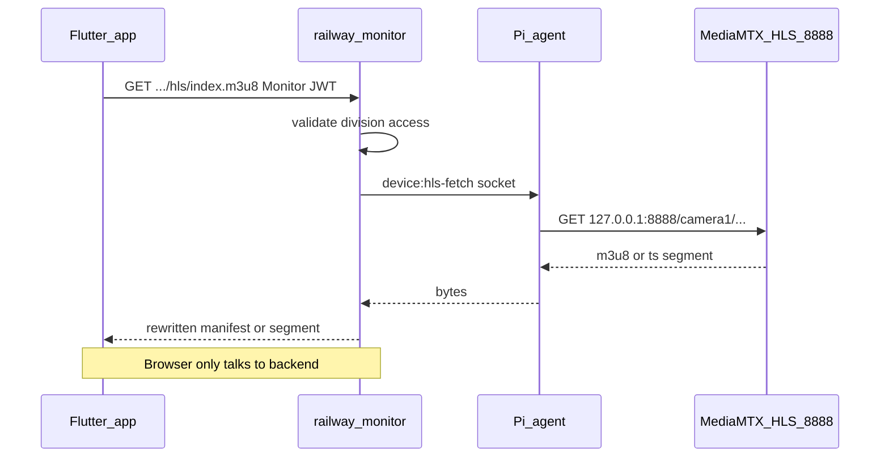
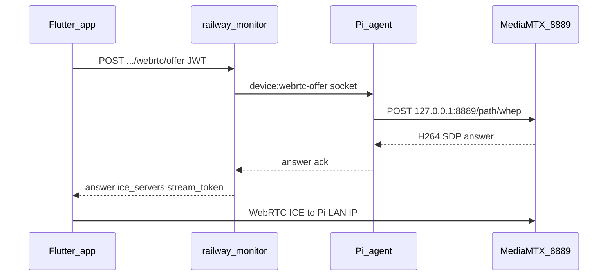

# RailWatch Streaming Architecture (MediaMTX)

This document describes the MediaMTX-based streaming pipeline for **remote monitoring from anywhere**.

## Production playback (remote)

**HLS proxy through the backend** — all video URLs point at `railwaymonitor.in`; the Pi is never contacted directly by clients.



Session gate: **every HLS request requires Monitor JWT** (same RBAC as WebRTC offer today).

| Stream type | Client widget | Backend URL |
|-------------|---------------|-------------|
| `cctv` / cameraN | HLS proxy (`VideoPlayerController`) | `GET .../streams/{name}/hls/index.m3u8` |
| `kiosk` | Frame polling (`KioskMjpegStreamView`) | `GET .../streams/{name}/frame` (or `live.mjpeg`) |

## LAN / dev playback (optional)

WebRTC socket mode (`PI_WEBRTC_PLAYBACK_MODE=socket`) — signaling via backend, **media direct to Pi LAN IP** (works only on station LAN):



Do **not** use WebRTC for home/internet clients — UDP to `192.168.x.x:8189` is unreachable.

## Pi (pi-code)

| Port | Protocol | Purpose |
|------|----------|---------|
| 9997 | HTTP API | Path health (`/v3/paths/list`) — agent poll |
| 8554 | RTSP | ffmpeg publish target for runOnDemand transcode |
| 8888 | HLS | **Production remote playback** (agent fetches for backend proxy) |
| 8889 | WebRTC | LAN/dev playback (WHEP) |

Configuration: [`docs/mediamtx.example.yml`](mediamtx.example.yml)

### H264 transcode (required for browser/HLS)

NVR substreams may be H265. Browser playback needs **H264**. Each camera path uses **ffmpeg runOnDemand**:

- Pulls NVR RTSP when a viewer connects
- Publishes `libx264` / `yuv420p` / baseline to `rtsp://127.0.0.1:$RTSP_PORT/$MTX_PATH`
- Stops when idle (`runOnDemandCloseAfter`)

First viewer cold-starts transcode (~10–20s).

### Auth

```yaml
authMethod: http
authHTTPAddress: https://railwaymonitor.in/api/mediamtx/auth
```

- **Agent localhost** WHEP, HLS, API poll, runOnDemand ffmpeg publish: allowed by backend auth (`ip: 127.0.0.1`)
- **LAN monitors (WebRTC only)**: require `stream_token` from `POST .../webrtc/offer`

### Agent

- `PI_PLAYBACK_IP` → reported as `ipAddress` to backend (WebRTC LAN mode)
- `MEDIAMTX_HLS_BASE_URL=http://127.0.0.1:8888` → agent HLS fetch for backend proxy
- `hls-proxy.js` → relays `device:hls-fetch` to localhost HLS
- `JPEG_PIPELINE_ENABLED=false` for WebRTC/HLS-only Pis (no persistent camera ffmpeg)
- `KIOSK_FRAME_ENABLED=true` → upload VNC snapshots for kiosk paths when JPEG pipeline is off
- `KIOSK_VNC_TARGETS=kiosk1|vnc://host:5900;kiosk2|vnc://host:5901` → VNC sources for kiosk paths

Diagnostics:

```bash
node agent/scripts/mediamtx-diagnose.js camera1 --whep
curl -s http://127.0.0.1:8888/camera1/index.m3u8
curl -s http://127.0.0.1:9997/v3/paths/list | jq .
```

## Backend (railway-monitor)

| Endpoint | Purpose |
|----------|---------|
| `GET .../streams/:name/hls/*` | **Production** — session-gated HLS proxy (manifest rewrite) |
| `POST .../streams/:name/playback` | Returns `hls_url` / `mjpeg_url` for client bootstrap |
| `GET .../streams/:name/live.mjpeg` | Kiosk multipart MJPEG (optional; Flutter polls `/frame`) |
| `POST .../streams/:name/webrtc/offer` | LAN/dev signaling gate |
| `POST /api/mediamtx/auth` | MediaMTX HTTP auth callback |

Environment:

| Variable | Default (prod) | Purpose |
|----------|----------------|---------|
| `PI_WEBRTC_PLAYBACK_MODE` | `hls` | Remote HLS proxy (use `socket` for LAN dev) |
| `HLS_PROXY_SOCKET_TIMEOUT_MS` | `15000` | Agent HLS fetch timeout |
| `HLS_PROXY_MAX_BODY_BYTES` | `8388608` | Max segment size |
| `STREAM_TOKEN_TTL_SEC` | `600` | MediaMTX WebRTC playback JWT TTL |
| `JWT_SECRET` | required | User JWT + stream_token signing |

## Flutter client (remote_monitoring_system)

1. `GET /api/monitoring/lobby-streams` → streams with `stream_type`, `pi_device_id`, `streamName`, `live_mjpeg_url`, `frame_url`
2. **Cameras (`stream_type: cctv`)**: `VideoPlayerController` → backend HLS proxy URL with `?token=` JWT
3. **Kiosks (`stream_type: kiosk`)**: `KioskMjpegStreamView` → poll `/frame` with Bearer JWT
4. `MediaMtxStreamView` (WebRTC) retained for LAN dev only when backend mode is `socket`

## TURN

Configured on Pi (`webrtcICEServers2`) and returned in offer response. Used when ICE cannot reach Pi LAN directly (WebRTC mode only).

## Migration notes

- go2rtc port 1984 retired
- Production remote = **HLS proxy**, not direct WebRTC
- Kiosk = MJPEG/frame via backend, not MediaMTX WHEP (kiosk paths are stubs)
- `devices.go2rtc_status` column stores MediaMTX health (legacy name)
