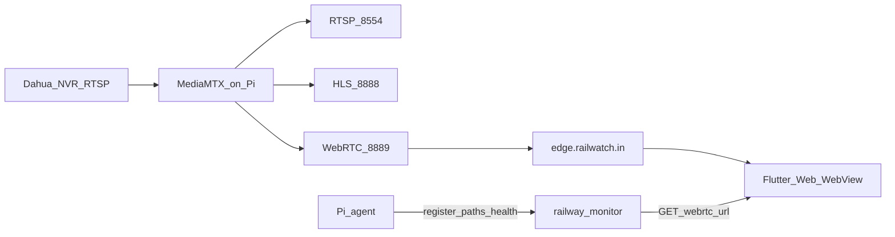

# RailWatch Streaming Architecture (MediaMTX)

This document describes the MediaMTX-based streaming pipeline used after the go2rtc migration.

## Pipeline overview



## Pi (pi-code)

MediaMTX runs as the only media gateway on each Raspberry Pi.

| Port | Protocol | Purpose |
|------|----------|---------|
| 9997 | HTTP API | Path health (`/v3/paths/list`) |
| 8554 | RTSP | Local debugging / agent JPEG snapshots |
| 8888 | HLS | Optional browser fallback |
| 8889 | WebRTC | Low-latency browser playback |

Configuration: [`docs/mediamtx.example.yml`](mediamtx.example.yml)

Install: [`agent/scripts/install-mediamtx.sh`](../agent/scripts/install-mediamtx.sh)

Camera paths: `camera1`–`camera5` (Dahua substream RTSP, TCP, on-demand). Kiosk paths (`kiosk1`, `kiosk2`) are stubs until VNC is migrated.

The Pi agent:

- Registers with backend including `mediamtxPaths`
- Polls MediaMTX API for stream health (no SDP/WebRTC proxying)
- Does **not** call go2rtc endpoints

Local validation:

```bash
curl -s http://127.0.0.1:9997/v3/paths/list | jq .
# Browser: http://127.0.0.1:8889/camera1/
node agent/scripts/mediamtx-diagnose.js camera1
```

## Backend (railway-monitor)

Control plane only — no media transport.

- Pi registration stores camera mappings in `stream_cameras` (`pi_device_id` + `mediamtx_path`)
- Lobby stream discovery: `GET /api/monitoring/lobby-streams`
- Play URL issuance: `GET /api/cameras/:id/webrtc-url`

Response example:

```json
{
  "success": true,
  "data": {
    "url": "https://edge.railwatch.in/webrtc/camera1",
    "token": "<optional JWT>",
    "expiresAt": "2026-06-21T10:00:00Z",
    "camera": {
      "id": "...",
      "legacyId": "<pi-uuid>_camera1",
      "mediamtxPath": "camera1"
    }
  }
}
```

Environment:

- `EDGE_WEBRTC_BASE_URL` — default `https://edge.railwatch.in/webrtc`
- `EDGE_WEBRTC_JWT_SECRET` — optional short-lived edge token signing
- `EDGE_WEBRTC_TOKEN_TTL_SEC` — default 3600

Legacy go2rtc WHEP proxy and socket stream-session SDP relay have been removed.

## Flutter client (remote_monitoring_system)

1. Load cameras from `GET /api/monitoring/lobby-streams`
2. For Pi cameras, fetch `GET /api/cameras/{id}/webrtc-url`
3. Render the returned URL in `MediaMtxStreamView` (WebView on mobile/web via `webview_flutter`)

Camera id format for API: `{piDeviceId}_{mediamtxPath}` (e.g. `b6ee0d2b-..._camera1`).

## Edge proxy

Public URL pattern:

- `https://edge.railwatch.in/webrtc/camera1` → Pi `http://<pi-host>:8889/camera1/`

The edge layer should terminate TLS, validate optional JWT tokens, and reverse-proxy to the Pi MediaMTX WebRTC endpoint.

## TURN

MediaMTX is configured with:

```yaml
webrtcICEServers2:
  - url: turn:turn.railwaymonitor.in:3478
    username: turnuser
    password: turnpassword
    clientOnly: true
```

Browsers connect through TURN when direct Pi/edge paths are blocked.

## Migration notes

- go2rtc (port 1984), custom SDP relay, and socket `request-stream` CCTV signaling are deprecated
- `devices.go2rtc_status` column now stores MediaMTX health snapshots for compatibility
- Migrate one camera (`camera1`) end-to-end before rolling out all paths
