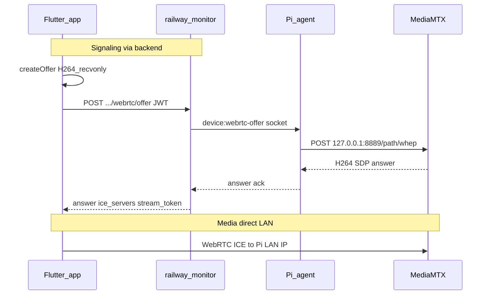

# RailWatch Streaming Architecture (MediaMTX)

This document describes the MediaMTX-based streaming pipeline (go2rtc Path A — socket WHEP relay).

## Pipeline overview



Production playback:

- **Signaling** always via backend → Pi agent → localhost WHEP
- **Media** direct browser ↔ Pi `:8889` (ICE from answer; `webrtcAdditionalHosts` = `PI_PLAYBACK_IP`)
- **No** raw Pi URL in API responses (`PI_WEBRTC_PLAYBACK_MODE=socket`)

## Pi (pi-code)

| Port | Protocol | Purpose |
|------|----------|---------|
| 9997 | HTTP API | Path health (`/v3/paths/list`) — agent poll |
| 8554 | RTSP | ffmpeg publish target for runOnDemand transcode |
| 8888 | HLS | Optional fallback |
| 8889 | WebRTC | Browser playback (WHEP) |

Configuration: [`docs/mediamtx.example.yml`](mediamtx.example.yml)

### H264 transcode (required for browser WebRTC)

NVR substreams may be H265. Browser WebRTC needs **H264**. Each camera path uses **ffmpeg runOnDemand**:

- Pulls NVR RTSP when a viewer connects
- Publishes `libx264` / `yuv420p` / baseline to `rtsp://127.0.0.1:$RTSP_PORT/$MTX_PATH`
- Stops when idle (`runOnDemandCloseAfter`)

### Auth

```yaml
authMethod: http
authHTTPAddress: https://railwaymonitor.in/api/mediamtx/auth
```

- **Agent localhost** WHEP + API poll: allowed by backend auth (`ip: 127.0.0.1`)
- **LAN monitors**: require `stream_token` from `POST .../webrtc/offer`
- `authInternalUsers` is **not** used when `authMethod: http`

### Agent

- `PI_PLAYBACK_IP` → reported as `ipAddress` to backend
- `sync-mediamtx-playback-ip.sh` → patches `webrtcAdditionalHosts` in `/etc/mediamtx/mediamtx.yml`
- `mediamtx-webrtc.js` → relays `device:webrtc-offer` to localhost WHEP
- `JPEG_PIPELINE_ENABLED=false` for WebRTC-only Pis

Diagnostics:

```bash
node agent/scripts/mediamtx-diagnose.js camera1 --whep
curl -s http://127.0.0.1:9997/v3/paths/list | jq .
```

## Backend (railway-monitor)

Control plane — no video relay.

| Endpoint | Purpose |
|----------|---------|
| `POST /api/monitoring/devices/:id/streams/:name/webrtc/offer` | Signaling gate; returns SDP answer + `stream_token` |
| `POST /api/mediamtx/auth` | MediaMTX HTTP auth callback |
| `GET /api/cameras/:id/webrtc-url` | **Deprecated** (410) in socket mode |

Environment:

| Variable | Default (prod) | Purpose |
|----------|----------------|---------|
| `PI_WEBRTC_PLAYBACK_MODE` | `socket` | Offer relay + stream tokens |
| `STREAM_TOKEN_TTL_SEC` | `600` | MediaMTX playback JWT TTL |
| `JWT_SECRET` | required | User JWT + stream_token signing |

## Flutter client (remote_monitoring_system)

1. `GET /api/monitoring/lobby-streams` → cameras with `piDeviceId` + `streamName`
2. `MediaMtxStreamView`: `createOffer` → `POST .../webrtc/offer` → `setRemoteDescription`
3. Render with `RTCVideoRenderer` (not WebView)

## TURN

Configured on Pi (`webrtcICEServers2`) and returned in offer response. Used when ICE cannot reach Pi LAN directly.

## Migration notes

- go2rtc port 1984 retired
- Direct WebView Pi URL mode deprecated in production
- `devices.go2rtc_status` column stores MediaMTX health (legacy name)
